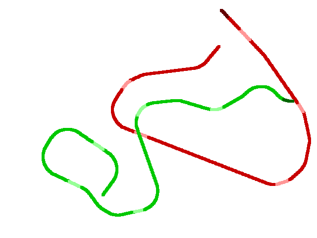

# What it is
This is a clone of the game *Achtung, die Kurve*!



# How to Run
You need:
- virtualenv
- python3

Try:

```
virtualenv .
pip install -r requirements.txt
source bin/activate
python snakes.py
```

and it should start.

## Key Bindings
You can find them at the top of *snakes.py*, but they are:
- left & right - arrow keys for player 1
- a & d - keys for player 2